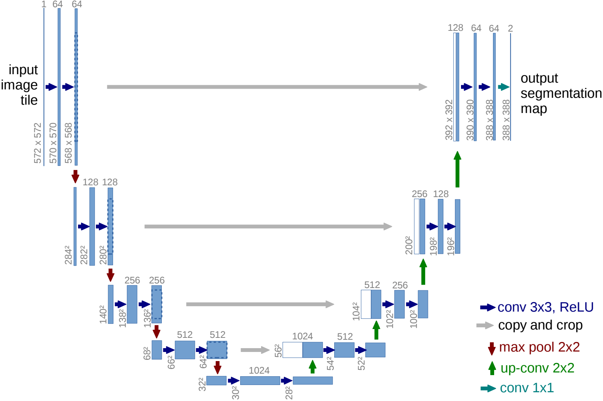

# UNet.py
simple minimal implementation of UNet from scratch in PyTorch

U-Net: Convolutional Networks for Biomedical Image Segmentation
https://arxiv.org/pdf/1505.04597

<!--  -->

  
&nbsp;

  
  
UNet architecture

